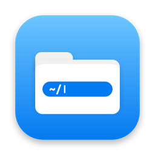

<p align="center">
  
</p>

<h1 align="center">FinderPath</h1>

<p align="center">A Windows-style address bar and right-click menu for the macOS Finder.</p>

<p align="center">
  <a href="https://github.com/AhmedAredah/FinderPath/releases/latest">Download</a> ·
  macOS 14 or later · Apple silicon and Intel
</p>

---

## Features

- **Go to Path**: a toolbar button that opens an editable path bar under the Finder toolbar. Type or paste a path and press Return to open it in the same window and tab.
  - Folders open in place. Files and apps open in their default app; ⌘Return shows them in their folder instead.
  - Tab completes names. Accepts `~`, relative paths, quoted or shell-escaped paths, and `file://` URLs.
  - Type `cmd` to open a terminal in the current folder, or `settings` for Settings.
- **New ▸** (right-click an empty area): create files from a customisable list, such as text, Markdown, HTML, scripts, or copies of your own templates for formats like Word and Pages. New files start in rename mode.
- **Open Terminal Here** (right-click an empty area): opens Terminal, iTerm2, Warp, Ghostty or another terminal of your choice.
- **Copy Path** (right-click files or folders): copies their full paths.
- **Settings**: turn each feature on or off and adjust its behaviour.

## Installation

1. Download `FinderPath-<version>.dmg` from [Releases](https://github.com/AhmedAredah/FinderPath/releases/latest) and drag FinderPath into Applications.
2. Open it. FinderPath isn't notarized by Apple, so macOS blocks the first launch:
   - **macOS 15 or later:** after the warning, go to **System Settings ▸ Privacy & Security** and click **Open Anyway**.
   - **macOS 14:** Control-click FinderPath in Applications, choose **Open**, then **Open** again.
3. The Welcome window guides you through the rest:
   - turn on the Finder extension;
   - add **Go to Path** to the toolbar (**View ▸ Customize Toolbar…**);
   - allow FinderPath to control Finder when asked.

To update, quit FinderPath and replace it in Applications. To uninstall, move it to the Trash. Its settings are in `~/Library/Group Containers/group.com.aredah.FinderPath`.

## Permissions

| Permission | Why |
|---|---|
| Finder extension | Adds the toolbar button and right-click items. |
| Automation (Finder) | Reads and changes the folder a Finder window shows. |
| Accessibility (optional) | Starts renaming files created from the **New** menu. |

## How it works

Finder offers no API for embedding controls in its windows, so the path bar is a floating panel positioned under the window's toolbar. The project has two parts:

- **`FinderPathSync`**: a sandboxed Finder Sync extension. It provides the toolbar button and menu items, and hands each action to the app through a `finderpath://` URL.
- **`FinderPath`**: a background app. It shows the path bar and Settings, and drives Finder through Apple Events. It isn't sandboxed, because it needs to script Finder and create files anywhere.

The two share settings through an app group.

## Building from source

Requires Xcode 16.

```sh
scripts/install.sh   # build, sign and install into /Applications
scripts/release.sh   # build a universal app and package dist/FinderPath-<version>.dmg
```

Both scripts sign with a self-signed certificate named **FinderPath Local Signing** if it's in your keychain, and fall back to ad-hoc signing if not. A stable certificate lets macOS keep its permissions across rebuilds; with ad-hoc signing, every build is treated as a new app. To create one:

```sh
openssl req -x509 -newkey rsa:2048 -nodes -keyout key.pem -out cert.pem -days 3650 \
  -subj "/CN=FinderPath Local Signing" -addext "extendedKeyUsage=critical,codeSigning" \
  -addext "keyUsage=critical,digitalSignature" -addext "basicConstraints=critical,CA:false"
openssl pkcs12 -export -legacy -inkey key.pem -in cert.pem -out id.p12 -passout pass:x -name "FinderPath Local Signing"
security import id.p12 -k ~/Library/Keychains/login.keychain-db -P x -T /usr/bin/codesign
rm -P key.pem id.p12
```

The app icon is generated by `swift scripts/make-icon.swift`.

## License

FinderPath is licensed under the [GNU Lesser General Public License v3.0](LICENSE).
